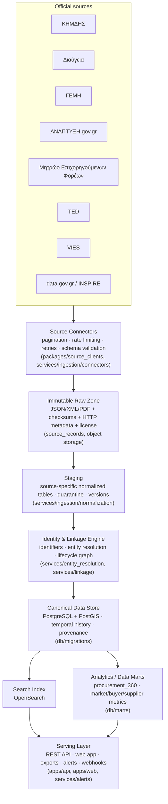
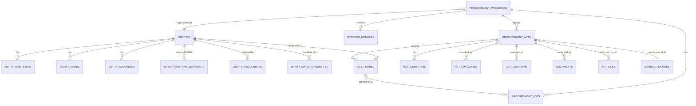

# Architecture Overview

Design for the Greek Public Procurement Intelligence platform described in
`description.txt`. This document explains the layered pipeline, the core
schema decisions, and the `procurement_360` unified read model — the piece
that makes "one common record per procurement, built from every platform"
concrete.

Companion documents:
- [`docs/data-dictionary/canonical-schema.md`](../data-dictionary/canonical-schema.md) — table-by-table reference
- [`docs/data-dictionary/source-mapping.md`](../data-dictionary/source-mapping.md) — raw field → canonical field, per source
- [`docs/source-contracts/`](../source-contracts/) — per-source endpoint/auth/rate-limit contracts

## 1. Pipeline



Every layer is designed so failures are cheap to recover from: raw payloads
are immutable and content-hashed (§13-14), cursors only advance after a
partition fully commits (§35), and quarantine (§33.3) isolates bad records
instead of blocking the pipeline.

## 2. Core design decisions

| Decision | Why | Spec ref |
|---|---|---|
| Normalized canonical store, not one wide table | 1-to-many facts (multiple suppliers, lots, amendments, documents per procurement) need real rows, not repeated JSON blobs; per-field provenance and temporal snapshots need a place to attach to | §6, §13-15, §24 |
| Append-only `source_records`, never overwritten | Reprocessing without re-fetching, schema-drift recovery, "what did we know on date X" | §13-14 |
| Identifiers live in `entity_identifiers`/`act_identifiers`, not scattered columns | One registry means one canonicalization/validation layer (ΑΦΜ checksum, ΑΔΑ/ΑΔΑΜ format) instead of N copies | §6.4, §7 |
| Match confidence hierarchy, hard rules on conflicting ΑΦΜ/ΓΕΜΗ | Prevents silent bad merges; every automated link is reversible and evidenced | §8, §25 |
| `process_id` is an internal UUID from the start, with `process_members` and `process_merge_log` | The "first ΑΔΑΜ = process_id" shortcut breaks the moment a chain extends or two chains merge; public URLs must survive a merge | §16.6 |
| `field_provenance` on every derived value | Backs the "evidence drawer" — every metric must explain how it was computed, from which records, with what confidence | §24, §31.8 |
| No corruption/political-affiliation/criminality modeling anywhere in the schema | Explicitly out of scope for the product; the schema itself enforces this by omission, not just UI copy | §41.3 |
| `mef_expenses.linked_act_id` is a *signal*, not a payment fact | ΜΕΦ is not a universal payments registry; UI must say "a declared expense possibly relates to..." | §20.3 |

## 3. Entity-relationship diagrams

### 3.1 Core identity + procurement lifecycle



### 3.2 Extended sources + analytics/workspace

```mermaid
erDiagram
    PROCUREMENT_ACTS ||--o| TED_NOTICE_DETAILS : "TED_NOTICE act"
    PROCUREMENT_ACTS ||--o{ FUNDING_LINKS : links
    FUNDING_LINKS }o--|| FUNDING_PROJECTS : to
    PROCUREMENT_ACTS ||--o{ MEF_EXPENSES : "linked_act_id (signal)"
    MEF_EXPENSES }o--|| MEF_ORGANIZATIONS : from

    PROCUREMENT_PROCESSES ||--o| PROCUREMENT_360 : "aggregated into (view)"

    TENANTS ||--o{ TENANT_MEMBERSHIPS : has
    TENANTS ||--o{ SAVED_SEARCHES : owns
    TENANTS ||--o{ OPPORTUNITY_PIPELINE_ITEMS : owns
    TENANTS ||--o{ ALERT_RULES : owns
    ALERT_RULES ||--o{ ALERT_EVENTS : fires
    ALERT_EVENTS ||--o{ WEBHOOK_DELIVERIES : delivered_via
    OPPORTUNITY_PIPELINE_ITEMS }o--|| PROCUREMENT_PROCESSES : references

    PROCUREMENT_ACTS ||--o{ MARKET_VALUE_METRICS : "aggregated (cpv x nuts x year)"
    OPPORTUNITY_SCORES }o--|| PROCUREMENT_PROCESSES : scores
    OPPORTUNITY_SCORES }o--|| TENANTS : "tenant-scoped fit"
```

## 4. `procurement_360`: the unified per-procurement record

`db/marts/procurement_360.sql` defines a view keyed by `procurement_processes.id`
that aggregates, in one row:

- process core fields (title, lifecycle status, amounts)
- buyer identity (name, ΑΦΜ, AAHT)
- suppliers, with their current ΓΕΜΗ snapshot and latest VIES check
- every act in the process (REQUEST → ... → PAYMENT), each with its full
  identifier set (ΑΔΑΜ/ΑΔΑ/...)
- lots, documents
- Διαύγεια decisions linked into the process
- TED notice details, where the procedure was also published EU-wide
- ΑΝΑΠΤΥΞΗ funding project linkage (budget/contracted/paid)
- ΜΕΦ expense signals (explicitly labeled as signals, per §20.3)
- execution locations (NUTS/municipality)
- a `data_quality` block: freshness, weakest link confidence in the act
  graph, and open data-quality issue count

This is what answers "who bought what, from whom, at what price, under what
funding" (the spec's central promise, §0) as a single query — while the
normalized tables underneath remain the audit trail: every field in the
aggregated view can be traced back through `field_provenance` /
`act_identifiers.source_record_id` to the exact raw payload it came from.

**It is a view, not a materialized snapshot, in this first design pass** — always
consistent with the canonical tables, at the cost of query-time joins. Convert
it to a materialized view (refreshed per affected `process_id`, driven by the
event chain in §37: source record change → canonical update → mart
invalidation) once query volume actually requires it. Do this reactively, not
speculatively — matches the spec's own "Postgres is enough for MVP" stance
(§10-11).

## 5. Known limitation of this design pass

There is no live PostgreSQL/PostGIS instance in this environment, so the SQL
in `db/migrations/` and `db/marts/` has been reviewed by hand for consistency
(FK targets exist, types line up) rather than executed. Running it end-to-end
against a real database — and fixing anything `psql`/`sqlfluff` catches — is
the first task of Στάδιο 1 (§44).
